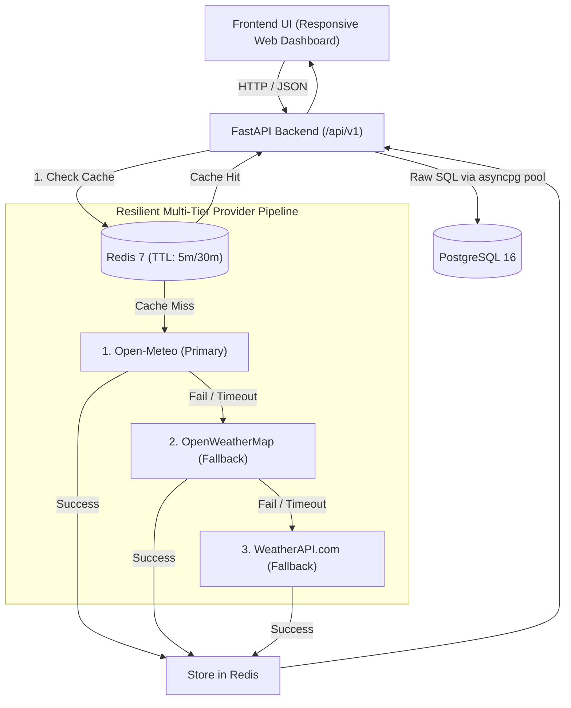

# Implementation Plan: Phase 1 (MVP) - Modern Weather Platform "Mosamiyan"

Phase 1 establishes the functional core of the "Mosamiyan" weather platform based on [functionalSpecificationDoc.md](file:///Users/amitsangwan/compusX/agentic_coding/.agents/specs/functionalSpecificationDoc.md) and [technicalSpecificationDoc.md](file:///Users/amitsangwan/compusX/agentic_coding/.agents/specs/technicalSpecificationDoc.md), incorporating specific architecture feedback.

## User Review Required

> [!IMPORTANT]
> **Database Access (Raw SQL over Asyncpg / Connection Pool)**:
> - No ORM will be used. Database interactions will use direct, parameterised raw SQL queries executed asynchronously via `asyncpg` connection pool.
>
> **Multi-Tier Provider & Fallback Strategy**:
> - **Current Weather & Forecasts**: Primary: **Open-Meteo** → Secondary Fallback: **OpenWeatherMap** → Tertiary Fallback: **WeatherAPI.com**.
> - **Radar Maps Layer (Preparation & Routes)**: Primary: **OpenWeatherMap** → Fallback: **WeatherAPI.com**.
> - Upstream requests are protected by a circuit breaker pattern (timeouts, retries, error failover) and cached in Redis.

---

## Proposed Architecture & Provider Fallback Pipeline



---

## Proposed Changes

### 1. Infrastructure & Environment Setup
- **[NEW] `docker-compose.yml`**: Defines PostgreSQL 16 (port 5432 with UUID extension & init scripts) and Redis 7 (port 6379, in-memory caching).
- **[NEW] `.env.example` & `.env`**:
  - PostgreSQL & Redis credentials.
  - `OPENWEATHERMAP_API_KEY`, `WEATHERAPI_KEY` (optional keys for fallbacks).
  - Default coordinates, cache TTLs, and service ports.
- **[NEW] `scripts/init_db.sql`**: Initial SQL schema containing `users`, `saved_locations`, `push_subscriptions`, and `weather_alerts` tables with indexes.
- **[NEW] `requirements.txt`**: `fastapi`, `uvicorn[standard]`, `pydantic>=2.0`, `pydantic-settings`, `asyncpg`, `redis>=5.0`, `httpx`, `jinja2` (for UI serving), `pytest`, `pytest-asyncio`.

---

### 2. Backend Application (`app/`)

#### Configuration & Raw SQL Database Connectivity
- **[NEW] `app/config.py`**: Pydantic `BaseSettings` for environment variables, API keys (OpenWeatherMap, WeatherAPI), Redis host/port, Postgres DSN, cache TTLs, and default location.
- **[NEW] `app/database.py`**: Async database connection pool manager using `asyncpg.create_pool`. Provides helper functions for executing queries and fetching records with parameter binding (`fetch_all`, `fetch_one`, `execute`).
- **[NEW] `app/db_queries.py`**: Clean, modular raw SQL queries and repository functions (e.g., `get_user_favorites_sql`, `insert_favorite_location_sql`, `delete_favorite_location_sql`, `count_user_favorites_sql`).

#### Schemas (Pydantic v2)
- **[NEW] `app/schemas/weather.py`**:
  - `LocationSchema`: name, region, country, lat, lon, timezone.
  - `AtmosphericCondition`: temp, feels_like, temp_min, temp_max, condition, condition_code, humidity, dew_point, pressure_hpa, pressure_trend, wind (speed_kmh, gust_kmh, direction_deg, cardinal), uv_index, uv_category, visibility_km, cloud_cover_pct, air_quality (`aqi_us`, `category`, `pm2_5`, `pm10`).
  - `HourlyForecastItem`: time, temp, feels_like, precip_probability, precip_amount_mm, condition_code, wind_speed_kmh.
  - `DailyForecastItem`: date, temp_min, temp_max, condition_code, precip_probability, precip_accumulation_mm, sunrise, sunset, uv_max.
  - `CurrentWeatherResponse`, `ForecastResponse`.
- **[NEW] `app/schemas/location.py`**:
  - `LocationSearchResult`, `LocationSearchResponse`, `FavoriteLocationCreate`, `FavoriteLocationResponse`.

#### Multi-Tier Provider & Services Layer
- **[NEW] `app/services/cache_service.py`**:
  - Redis async caching with spatial coordinate normalization (`round(lat, 2)`, `round(lon, 2)`).
  - Keys: `weather:current:{lat}:{lon}`, `weather:hourly:{lat}:{lon}`, `weather:daily:{lat}:{lon}`, `geo:search:{q}`.
- **[NEW] `app/services/providers/base_provider.py`**: Abstract base class defining common interface (`fetch_current_weather`, `fetch_forecast`, `search_locations`).
- **[NEW] `app/services/providers/openmeteo_provider.py`**: Primary provider (Open-Meteo API + Open-Meteo Geocoding + Air Quality API).
- **[NEW] `app/services/providers/openweathermap_provider.py`**: Secondary fallback provider for current/forecasts and primary for radar tile metadata.
- **[NEW] `app/services/providers/weatherapi_provider.py`**: Tertiary fallback provider for weather and radar fallback.
- **[NEW] `app/services/weather_service.py`**:
  - Coordinates Redis cache lookup -> Primary provider fetch with sequential fallback failover (Open-Meteo → OpenWeatherMap → WeatherAPI) -> Cache storage -> Unit conversions (Metric / Imperial).
- **[NEW] `app/services/location_service.py`**:
  - Geocoding autocomplete with Redis caching.
  - Favorites management using direct parameterised SQL (CRUD, enforces max 5 favorites per user for MVP, handles unique coordinates).

#### API Endpoints (`app/api/v1/`)
- **[NEW] `app/api/v1/endpoints/weather.py`**:
  - `GET /api/v1/weather/current?lat={lat}&lon={lon}&units={metric|imperial}`
  - `GET /api/v1/weather/forecast?lat={lat}&lon={lon}&hourly_steps=24&daily_steps=7&units={metric|imperial}`
- **[NEW] `app/api/v1/endpoints/locations.py`**:
  - `GET /api/v1/locations/search?q={query}`
  - `GET /api/v1/locations/favorites`
  - `POST /api/v1/locations/favorites`
  - `DELETE /api/v1/locations/favorites/{id}`
- **[NEW] `app/api/v1/endpoints/health.py`**:
  - `GET /api/v1/health` (PostgreSQL raw query check, Redis ping, and upstream status).
- **[NEW] `app/main.py`**: FastAPI application entry point, lifespan management (`asyncpg` pool & Redis connection pool lifecycle), CORS middleware, and route mounting.

---

### 3. Frontend Web Interface

- **[NEW] Web UI Dashboard (`app/templates/` & `app/static/`)**:
  - Modern responsive interface (HTML5, Tailwind CSS / vanilla styling, Vanilla JS).
  - **Predictive Omnibox Search**: Geocoding typeahead with debounced dropdown and recent search history.
  - **Instant Unit Toggle**: Live switch between Metric (°C, km/h) and Imperial (°F, mph) without full page reload.
  - **Geolocation Auto-Detect**: Prompts for browser geolocation, falls back gracefully to default city.
  - **Current Conditions Hero Card**: Displays current temp, high/low, feels like, weather icon, and all 9 atmospheric metrics (Humidity, Dew Point, Wind Compass & Gusts, Barometric Pressure & Trend, UV Rating & Safety Badge, Visibility, Cloud Cover, Air Quality AQI).
  - **24-Hour Hourly Scrubber**: Interactive timeline showing hourly temperatures, precipitation chance bars, and condition icons.
  - **7-Day Extended Forecast**: Daily forecast list showing min/max temperature visual range bars, rain chances, and conditions.
  - **Saved Favorites Bar**: Quick access bar to star the active city and switch between up to 5 saved favorite locations.

---

## Verification Plan

### Automated Tests
- **[NEW] `tests/test_health.py`**: Tests for health status, DB connectivity, and Redis ping.
- **[NEW] `tests/test_providers.py`**: Mock tests verifying primary Open-Meteo success, and sequential fallback to OpenWeatherMap and WeatherAPI when primary fails.
- **[NEW] `tests/test_weather_service.py`**: Tests for coordinate spatial rounding, cache hit/miss behavior, and metric/imperial unit conversions.
- **[NEW] `tests/test_db_queries.py`**: Direct tests for raw SQL favorite location CRUD operations against `asyncpg`.
- **[NEW] `tests/test_weather_endpoints.py`**: Integration tests for `/api/v1/weather/current`, `/api/v1/weather/forecast`, and `/api/v1/locations/search`.

Command to run automated tests:
```bash
pytest tests/ -v
```

### Manual Verification
1. Start infrastructure: `docker compose up -d`.
2. Start backend server: `uvicorn app.main:app --reload --port 8000`.
3. Open `http://localhost:8000`:
   - Verify Geolocation auto-detection loads localized weather.
   - Search for a city (e.g., "New Delhi", or "Tokyo") and verify autocomplete dropdown and forecast loading.
   - Test unit switcher: verify all units (°C to °F, km/h to mph) toggle instantly.
   - Star/save a favorite city and verify it appears in the favorites quick bar and persists across reloads.
   - Simulate primary provider downtime (e.g. by intercepting or mocking error) and verify smooth fallback to secondary provider.
